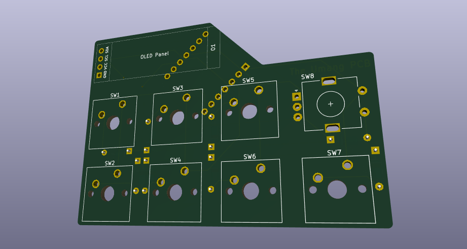
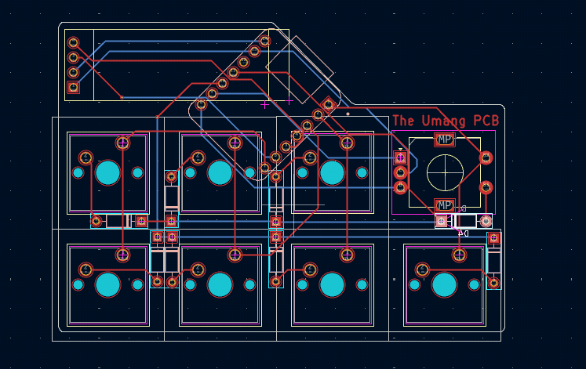

# Hackpad

built by Umang Kumar Singh for HackClub 2026

Hackpad is my first crack at a hardware project — a simple macropad with seven keys and a rotary encoder. Seven keys for whatever macros you want (calculator hotkey, anyone?), and the encoder handles volume or media scrubbing.

The body is two 3D-printed shells held together with M3 screws and heat-set inserts, with a translucent acrylic plate sandwiched in between. The plate can be swapped out pretty easily if you ever want to change the look.

Under the hood it runs QMK with two layers — a mix of keys I don't have easy access to on my main keyboard, plus a few keycodes I thought were amusing. The 128x32 OLED scrolls through *very important and relevant* information on loop.

Overall this was a blast. I'd never done PCB design before, and learning KiCad from scratch was surprisingly rewarding. The case was straightforward in CAD, and working around the PCB constraints made for a fun little puzzle. Firmware was the biggest headache, but after digging through QMK and XIAO docs for a while things started clicking. Once the parts arrived, assembly was smooth — I only had to reprint the case once.

9/10. Would build again.

## PCB

# Bill of materials
- 7x Cherry MX-style keyswitches.
- 4x M3x12mm screws
- 4x M3 X D4.6 X L3.6
- 8x 1N4148 Diodes (through hole)
- 1x EC11 Rotary encoder
- 1x 0.91 inch SSD1306 OLED
- 14x Mill-Max 3305s or 0305s.
